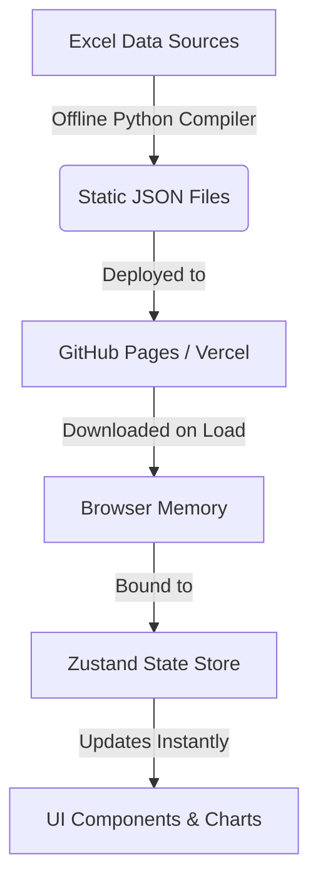

# System Architecture — React Fly Gene Expression Explorer

## 1. High-Level Architecture
The application runs as a **fully client-side Single Page Application (SPA)**. 



## 2. Directory Structure

```
yaskhalil/flyGPlot/
├── application/
│   ├── docs/                   # Documentation folder (.md files)
│   ├── src/
│   │   ├── backend/            # Data preparation pipeline (Python)
│   │   │   ├── prepare_data.py # Script converting raw Excels to compressed JSON
│   │   │   └── dataset.py      # Core Excel loading utility
│   │   └── frontend/           # The new React SPA
│   │       ├── public/
│   │       │   └── data/       # Compiled static expression datasets
│   │       ├── src/
│   │       │   ├── components/ # Pure UI & visualization elements
│   │       │   ├── store/      # Zustand store for universal filters/state
│   │       │   ├── services/   # External API clients (Ensembl synonym resolver)
│   │       │   ├── App.tsx     # Main dashboard framework
│   │       │   └── index.css   # Tailwind configuration & global typography
│   │       ├── package.json
│   │       └── vite.config.ts
```

## 3. Technology Stack & Packages
- **Framework & Bundler**: React 18, TypeScript, Vite (fast, zero-overhead client build).
- **Styling**: Tailwind CSS (sleek dark/light theme tokens, glassmorphism card panels).
- **State Management**: **Zustand** (lightweight hook-based store that minimizes React re-renders and handles universal filtering).
- **Data Loaders**: PapaParse (if loading CSVs) or standard browser `fetch` for compressed JSON assets.
- **Visualizations**: 
  - **Plotly.js (via react-plotly.js)**: For advanced, zoomable strip plots, interactive scatter views, and LOWESS local regression models.
  - **Lucide React**: For clean, modern UI icon sets.

## 4. Universal Filtering Pipeline
- Filters (stages, threshold, exclusion) are stored in the Zustand store.
- When any filter is adjusted in the Sidebar, Zustand triggers subscribers across all rendered charts.
- The charts filter their internal datasets in-memory ($O(N)$ lookup where $N \le 11,299$ rows) and re-draw instantly using hardware-accelerated Canvas/SVG inside Plotly, offering a lag-free exploration experience.
